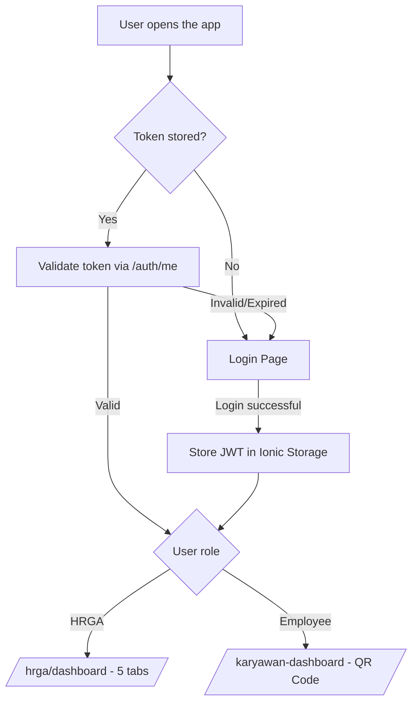

# 📱 Ionic Catering System QR

Mobile companion app for **Laravel Catering System QR** — a hybrid mobile application built with **Ionic + Angular (Standalone) + Capacitor**, providing interfaces for Employees (dynamic QR token generation) and HRGA (employee management, order scheduling, monitoring & reporting).

---

## 📋 Table of Contents

- [About the Project](#-about-the-project)
- [Key Features](#-key-features)
- [Tech Stack](#-tech-stack)
- [Architecture & Authentication Flow](#-architecture--authentication-flow)
- [Role Structure & Navigation](#-role-structure--navigation)
- [Installation](#-installation)
- [Environment Configuration](#-environment-configuration)
- [Build & Deploy to Android](#-build--deploy-to-android)
- [Project Structure](#-project-structure)
- [Known Issues & Roadmap](#-known-issues--roadmap)
- [License](#-license)

---

## 📖 About the Project

This is the mobile client for the QR-based employee catering system, connected to the [Laravel Catering System QR](https://github.com/reihanKhadafiB/Laravel-Catering-System-QR) backend via a JWT-authenticated REST API.

Built with the Ionic Framework on top of Angular standalone components (project type: `angular-standalone`, using the native Angular CLI rather than Ionic CLI serve), and wrapped with Capacitor for native Android builds while remaining deployable as a web app.

Core mobile flow:

1. **Employee** logs in → dashboard displays a **dynamic QR Code** that auto-refreshes, used as proof of meal claim.
2. **HRGA** logs in → gains access to a 5-tab management interface: Dashboard, Employees, Orders, Consumption, and Report — mirroring the same feature set as the web version.

> This app does not include an interface for the **Cook (Koki)** role — QR scanning for that role is handled through the separate web application.

---

## ✨ Key Features

### Employee
- JWT-authenticated login
- Personal dashboard with profile photo & personal data
- Dynamic QR Code that automatically refreshes every 15 seconds
- Dark mode toggle (follows system preference or manual override)

### HRGA
- Summary statistics dashboard (employees, orders, consumption)
- Employee data management (list & create/edit form, with camera capture for profile photo via `@capacitor/camera`)
- Order schedule management (list & create/edit form)
- Daily consumption monitoring
- Consumption reports with period filters

### General
- Auto-login (JWT persisted locally via `@ionic/storage-angular`, automatic role-based redirect)
- Route guards to prevent access to protected pages without authentication
- HTTP Interceptor that automatically attaches the JWT token to every API request targeting the configured API URL

---

## 🛠️ Tech Stack

| Layer | Technology |
|---|---|
| Framework | Ionic Framework + Angular 19 (Standalone Components) |
| Mobile Wrapper | Capacitor 7 (Android target) |
| State & Reactivity | RxJS (`BehaviorSubject`, Observable pipelines) |
| Local Storage | `@ionic/storage-angular` |
| HTTP Client | Angular `HttpClient` + custom `HttpInterceptor` (JWT) |
| QR Code Generation | `qrcode-generator` |
| Native Device Access | `@capacitor/camera` (profile photo capture) |
| Charts | `chart.js` (HRGA dashboard/report visualizations) |
| Styling | SCSS, Tailwind CSS |
| Icons | Ionicons |
| Testing | Karma + Jasmine |

> **Note:** several Capacitor plugins are listed as dependencies (`@capacitor/geolocation`, `@capacitor/dialog`, `@capacitor/filesystem`, etc.) but are not currently referenced anywhere in `src/app` — only `@capacitor/camera` was confirmed in active use (employee photo capture). The unused plugins likely represent scaffolding left over from the Capacitor template or features planned but not yet implemented.

---

## 🔄 Architecture & Authentication Flow



Every API request automatically passes through `JwtInterceptor`, which attaches an `Authorization: Bearer <token>` header when the request targets `environment.apiUrl`.

---

## 👥 Role Structure & Navigation

| Role | Main Page | Route |
|---|---|---|
| **Employee** | QR Code Dashboard | `/karyawan-dashboard` |
| **HRGA** | Tabs: Dashboard, Employees, Orders, Consumption, Report | `/hrga/*` |

> ⚠️ Navigation between roles is currently controlled by `AuthGuard`, which validates login state only — not the specific user role. See [Known Issues](#-known-issues--roadmap).

---

## ⚙️ Installation

### Prerequisites
- Node.js (LTS) & NPM
- Angular CLI (`npm install -g @angular/cli`) — project uses `ng` scripts directly
- Ionic CLI (optional, for Capacitor tooling: `npm install -g @ionic/cli`)
- Android Studio (for Android builds/emulator)
- A running instance of the [Laravel Catering System QR](https://github.com/reihanKhadafiB/Laravel-Catering-System-QR) backend

### Installation Steps

```bash
# 1. Clone the repository
git clone https://github.com/reihanKhadafiB/Ionic-Catering-System-QR.git
cd Ionic-Catering-System-QR

# 2. Install dependencies
npm install

# 3. Run in development mode (browser)
npm start
# equivalent to: ng serve
```

The app will run at `http://localhost:4200` by default (standard Angular CLI dev server).

---

## 🔧 Environment Configuration

Configure the API base URL in `src/environments/environment.ts` (development) and `environment.prod.ts` (production):

```typescript
export const environment = {
  production: false,
  apiUrl: 'http://localhost:8000/api' // adjust to match your Laravel backend URL
};
```

> 💡 Both environment files currently point to the same production domain. It is recommended to separate the API URL for local development so that testing does not inadvertently write to production data.

---

## 📦 Build & Deploy to Android

```bash
# 1. Build the Angular app
ng build

# 2. Sync with the Android project (Capacitor)
npx cap sync android

# 3. Open the project in Android Studio
npx cap open android

# 4. Run on a device/emulator from Android Studio,
#    or build an APK/AAB directly from Android Studio (Build > Generate Signed Bundle/APK)
```

For live-reload development directly on a device:

```bash
npx cap run android -l --external
```

---

## 📁 Project Structure
- `src/app/`
  - `guards/` — Route guards (`AuthGuard`, `AutoLoginGuard`)
  - `interceptors/` — JWT HTTP Interceptor
  - `services/` — `AuthService`, `ThemeService`
  - `login/` — Login page
  - `karyawan-dashboard/` — Employee dashboard & QR generator
  - `hrga/`
    - `tabs/` — Tab container for HRGA
    - `hrga-dashboard/` — Summary dashboard
    - `employee-list/` — Employee list
    - `employee-form/` — Employee create/edit form (with camera capture)
    - `orders/` — Order schedule list
    - `order-form/` — Order create/edit form
    - `konsumsi/` — Consumption monitoring
    - `report/` — Consumption reports

---

## ⚠️ Known Issues & Roadmap

This project is under active development and has undergone internal technical review. The following areas have been identified and are planned for improvement in upcoming iterations:

- [ ] **Role-based route guard** — `AuthGuard` currently validates login state only, not the specific role required for `/hrga/*` routes. A dedicated `RoleGuard` is planned.
- [ ] **QR polling interval vs. token TTL** — the QR refresh interval (15 seconds) currently matches the backend token's exact validity window (15 seconds), which can cause a race condition where a token expires mid-scan. A buffer/refresh margin is planned.
- [ ] **API error message propagation** — the original error response from the backend is not fully surfaced to the UI (`AuthService` currently wraps errors with a generic message).
- [ ] **Refresh token integration** — the backend exposes a `/auth/refresh` endpoint, but `JwtInterceptor` does not yet use it to silently refresh expired tokens.
- [ ] Separate API URL configuration for development and production environments.
- [ ] Clean up unused Capacitor plugin dependencies (e.g. `@capacitor/geolocation`, `@capacitor/dialog`) not currently referenced in the codebase, to reduce bundle size and build complexity.

Contributions and feedback are welcome via *Issues* or *Pull Requests*.

---

## 📄 License

This project is licensed under the [MIT License](https://opensource.org/licenses/MIT).

---

**Developed by** [Reihan Khadafi](https://github.com/reihanKhadafiB) — Backend Developer & Informatics Engineering Student.

**Related project:** [Laravel Catering System QR](https://github.com/reihanKhadafiB/Laravel-Catering-System-QR) (Backend)
